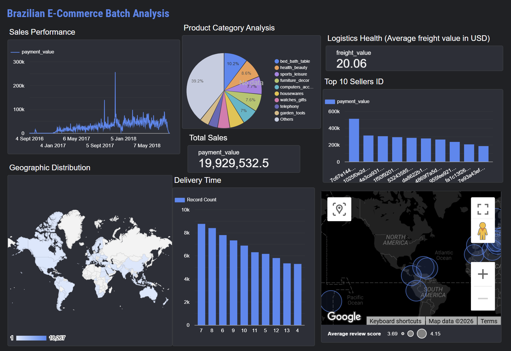

# 🛒 Olist E-commerce End-to-End Analytics Pipeline
### *A Hybrid Batch & Real-Time ELT Solution with Kestra, Pub/Sub, dbt, and BigQuery*

---

## 📖 Project Overview
This project demonstrates a professional-grade **Hybrid Data Pipeline**. It successfully combines **Batch ELT** (for historical deep-dives) and **Real-Time Streaming** (for live order monitoring). By leveraging the Olist e-commerce dataset, the system automates the journey from raw ingestion to high-fidelity executive dashboards, simulating a live Amazon FBM (Fulfilled by Merchant) environment.

## 🛠️ Tech Stack
| Layer | Tool | Purpose |
| :--- | :--- | :--- |
| **Orchestration** | `Kestra` | Workflow management and batch automation |
| **Streaming** | `Google Pub/Sub` | Real-time message queuing (The "Post Office") |
| **Ingestion** | `Python` & `dlt` | Extracting Olist CSVs and loading to BigQuery |
| **Processing** | `Python SDK` | Custom real-time consumer for lag calculation |
| **Warehouse** | `Google BigQuery` | Highly scalable cloud data storage (Medallion Schema) |
| **Transformation** | `dbt Core` | SQL modeling, casting, and data joins |
| **Visualization** | `Looker Studio` | Business Intelligence and real-time reporting |

---

## 🏗️ Architecture & Workflow

### 1. Ingestion & Streaming
The pipeline now operates on two distinct speeds:
* **Batch (Bronze):** A **Kestra** flow triggers **dlt** (Data Load Tool) to ingest historical Olist datasets into BigQuery.
* **Streaming (Live):** A Python-based **Producer** simulates live Amazon orders by publishing records to **GCP Pub/Sub**. A dedicated **Consumer** script listens to the subscription, calculates **Consumer Lag**, and streams records directly into BigQuery using `insert_rows_json`.

### 2. Transformation (**Silver & Gold Layers**)
We use **dbt** to structure both historical and live data into a maintainable hierarchy:
* **Staging (Silver):** Cleans raw data, applies `CAST` operations, and standardizes date formats (DD/MM/YYYY).
* **Marts (Gold):** Joins relational tables into a denormalized **Reporting Master** table, optimized for BI performance and sub-second dashboard loading.

### 3. Observability & Quality
* **Latency Monitoring:** Real-time calculation of "Consumer Lag" (the time difference between order creation and warehouse ingestion).
* **Testing:** Automated dbt tests ensure `unique` and `not_null` constraints on primary keys.
* **IAM Security:** Implemented the **Principle of Least Privilege** using GCP Service Accounts with granular roles (Pub/Sub Subscriber, BigQuery Data Editor).

---

## 📊 Business Insights
The final **Looker Studio** dashboard provides visibility into:

[🔗 View Interactive Dashboard (Live Link)](https://lookerstudio.google.com/u/0/reporting/937029e7-5a02-4647-9ae0-97578899d0a4)
* **Product Category Analysis:** A Bar chart of product category percentages sales. 
* **Logistics Performance:** Distribution of delivery times from purchase to customer arrival.
* **Geographic Sales:** A heatmap of orders cross states.
* **Growth Metrics:** Time-series analysis of historical purchasing volume.
* **Top 10 Sellers:** Bar chart showing the top 10 best sellers 


## 💻 Setup & Installation

1.  **Clone the Repository:**
    ```bash
    git clone <your-repo-url>
    ```
2.  **Install Dependencies:**
    ```bash
    pip install -r requirements.txt
    ```
3.  **Environment Configuration:**
    - Place your `google_credentials.json` in the root folder.
    - Set your Project ID and Subscription ID in `streaming_pipeline/config.py`.
4.  **Run the Pipeline:**
    - **Batch:** Execute the flow via the **Kestra UI**.
    - **Streaming:** Run `python streaming_pipeline/producer_pubsub.py` and `python streaming_pipeline/consumer_live.py` in separate terminals.
    - **Transform:** Run `dbt build` to finalize the Gold layer.

---

> **Note:** This project was developed in **May 2026** as a comprehensive data engineering showcase, evolving from a batch-only process to a modern hybrid streaming architecture.

### 🛡️ Security
Standard professional security protocols are followed. All sensitive credentials (GCP JSON keys), environment variables, and local virtual environments are excluded via `.gitignore`.